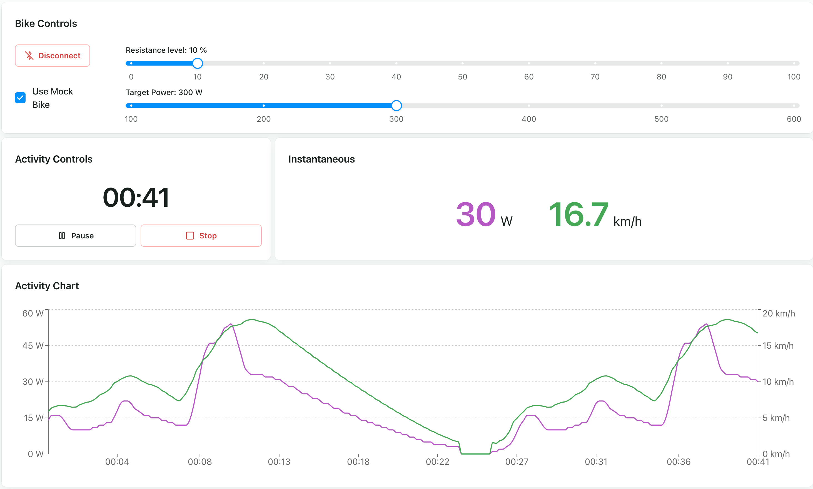

# Smart Trainer Control

Control a Van Rysel D100 smart trainer from your browser via Web Bluetooth.

**[bike.ognjenbostjancic.com](https://bike.ognjenbostjancic.com)**



## Stack

React 19, TypeScript, Vite, Park UI (Panda CSS), Recharts, Web Bluetooth API

## Setup

```bash
pnpm install
pnpm dev       # dev server
pnpm build     # production build
pnpm test      # run tests
pnpm lint      # eslint
```

Requires a Chromium-based browser (Chrome, Edge, or Opera) — Web Bluetooth is not supported in Firefox or Safari.

## License

MIT
